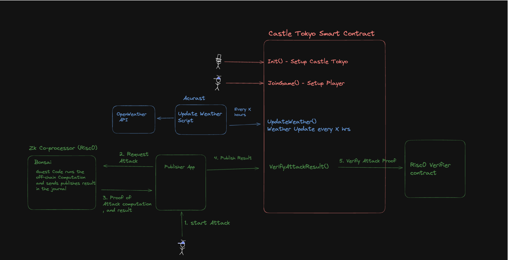
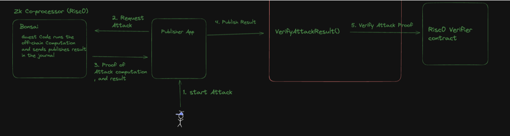
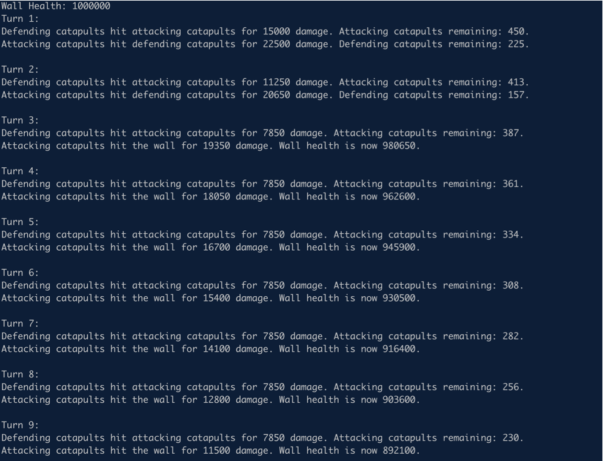
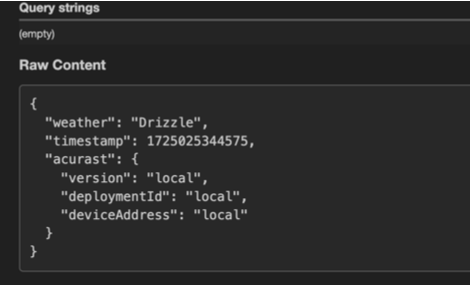
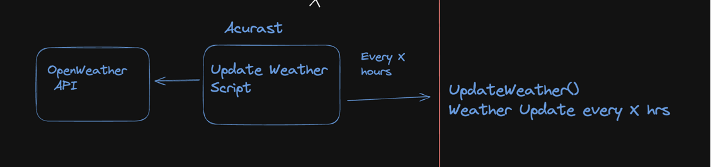
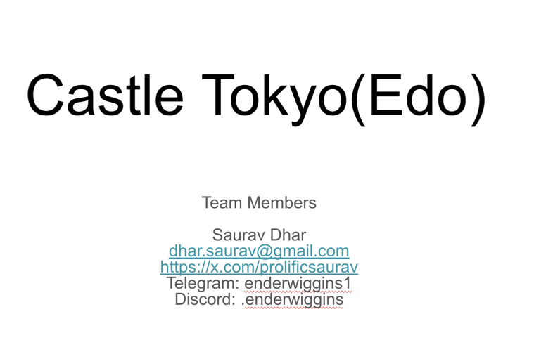

## Github Links for the Project
*  Battle Simulator in JS - https://github.com/enderNakamoto/castle_edo_sim_js
*  Acurast Weather - https://github.com/enderNakamoto/acurast_tokyo_weather
*  (The Most Important) Risc0 ZKVM Guest/Host Code and the Smart Contract - https://github.com/enderNakamoto/castle_edo

## Overview

Castle Tokyo (also known as Castle Edo) is a proof-of-concept game designed to integrate Risc0's zkVM for offchain computation with Acurast Oracles to retrieve real-time weather data for Tokyo, which influences the outcome of battles.

This project was developed during a hackathon with the primary focus on laying the groundwork for future fully on-chain games rather than creating a UX-friendly experience. While some objectives have been achieved, significant work and integration are still required to reach the full potential of this concept. The ultimate goal is to establish a game framework that leverages zk technology for privacy and scalability, while using oracles to obtain random numbers (VRF) or other intriguing data—such as weather in our case—to enhance the game's dynamics.

## Rules of the Game 

In Castle Tokyo, there can only be one daimyo, the lord who rules the castle. To take control, other players must assemble their armies and launch attacks to dislodge the current daimyo. Each player receives a "turn" when they join the game, with one "turn" allowing for a single attempted attack. If the attack is successful, the attacker becomes the new daimyo.

Players have the option to purchase additional "turns," with the proceeds going to the current daimyo, creating an incentive to maintain control of the castle. This dynamic encourages strategic play, as holding the castle can be lucrative.

Both attacking and defending armies must adhere to specific rules and limitations, requiring players to act strategically. Additionally, the real-time weather in Tokyo plays a crucial role in the effectiveness of certain units. This means that choosing the right moment to attack, when the weather is most advantageous, can be the key to victory—mirroring the strategic importance of weather in real-world battles.

## Technical Details 



There are various parts to the game: 
* The Smart Contract 
* Weather Oracle 
* ZkVM 
  * Guest Code Hosted in Bonsai (or could be a private cluster)
  * Host Code (App that sends inputs to the Guest Code) - Simulated through tests in POC 
* Frontend ( Not implemented here) 

Lets go over each of them one at a time: 

## The Smart Contract

The CastleTokyo smart contract is designed to simulate a strategic game where players can join, set up defenses, and attempt to attack and take over a castle. The contract includes various roles, such as the "daimyo" (the lord of the castle), and involves mechanics like setting the weather, configuring defense units, and verifying attacks. Below is a detailed explanation of the main functions and features of the contract:

### Main Components:

#### Roles:

* Daimyo: The lord of the castle, who initially controls the defense and other key functionalities of the castle.
* Weather Setter (Acurast Oracle): An authorized address responsible for setting the weather conditions in the game.
* Joined Players: Players who have joined the game and can perform actions like attacking.


#### State Variables:

* daimyo: The address of the current daimyo.
* weatherSetter: The address authorized to set the weather.
* lastWeatherSetTime: The timestamp of when the weather was last set.
* attackCount: Tracks the number of attacks that have occurred.
* playerTurns: A mapping of player addresses to their remaining turns.
* joinedPlayers: A mapping to track which players have joined the game.
* currentDefense: A struct holding the current defense composition of the castle.
* currentWeather: An enum representing the current weather condition.
* Defense 

### Functions

1. setDefense
The setDefense function allows the current daimyo (the lord of the castle) to establish the castle's defensive capabilities by specifying the number of different military units, including infantry, cavalry, archers, catapults, and ballistae. This function ensures that the total number of defense units does not exceed a predefined maximum (DEFENSE_MAX). Only the daimyo can call this function, which is enforced by the onlyDaimyo modifier.

2. setWeather
The setWeather function is responsible for updating the weather conditions within the game. It is called by the Acurast oracle every 12 hours, which retrieves weather data from the OpenWeather API. The function takes an enum value representing the current weather state (Clear, Cloudy, or Raining) and records the timestamp when the weather was last set. The use of the onlyWeatherSetter modifier ensures that only the Acurast oracle, designated as the authorized weather setter, can call this function, maintaining the integrity and accuracy of the weather data within the game.

3. joinGame
The joinGame function allows a player to enter the game. Upon joining, the player is marked as a participant and is granted one turn, which they can use to perform actions like attacking the castle. The function ensures that a player can only join the game once by checking if they have already joined. This prevents duplicate entries and ensures fair gameplay.

4. gainTurn
The gainTurn function currently allows players who have already joined the game to gain additional turns for free. Each turn provides the player with an opportunity to take actions within the game, such as attempting to attack the castle. While the function is free for all players at the moment, there are plans to eventually require players to pay to acquire additional turns, adding an economic layer to the game's strategy. The function ensures that only players who have joined the game can gain turns, reinforcing the game's participation structure.

5. verifyAttack
The verifyAttack function is central to the gameplay, allowing players to attempt an attack on the castle. The function first checks that the player has at least one turn available and that the daimyo has set up a defense. The attack is then verified using an off-chain process, where a verifier checks the validity of the attack based on provided parameters (x and seal). If the attack is successful and x equals 1, the attacking player becomes the new daimyo. Regardless of the outcome, one turn is deducted from the player who called the function. This function enforces strategic gameplay, where players must manage their turns and carefully plan their attacks.

## ZKVM 

Now. lets talk about offchain computation: 

This proof-of-concept (POC) implements the first phase of what will eventually be a multi-phase battle simulation. In this initial phase, the attacking catapults target the wall while the defending catapults fire back, aiming to destroy the attacking catapults. This phase sets the foundation for future phases that will add more complexity to the battle dynamics.

A Zero-Knowledge Virtual Machine (ZKVM) enables off-chain computations with verifiable results, crucial for scaling blockchain applications. In this POC, the guest code, which simulates the battle's first phase, runs within the ZKVM. It takes the number of attacking catapults as input and calculates whether the attackers damage the wall, the defenders repel the attack, or if it's a draw. The ZKVM then produces a cryptographic proof, which is verified by the host code to ensure the off-chain computation is accurately reflected on-chain. This proof, stored as a journal, contains the computation's output, while the associated seal ensures its integrity. The guest code can be executed in a service like Bonsai or another hosted environment, making it easier to manage complex computations while keeping the blockchain light and scalable.

While privacy is a potential benefit of using ZKVM, it was not the focus of this POC. The primary objective was to demonstrate the capability to offload and verify computations off-chain to improve scalability. However, ZKVM also supports privacy-preserving computations, where sensitive data can remain confidential while still generating verifiable proofs.

This is the order of data flow in this POC:



## Simulation 

Instead of consolidating everything into a single Rust guest code program, we chose to implement the battle simulation logic in TypeScript while reserving the Rust guest code for verifying the outcomes. While this approach may result in a more extensive codebase, it allows us to build a richer, more dynamic experience for our end users. In the TypeScript simulation, we can introduce complex strategy game elements like tracking the strength of the castle walls, monitoring when troops fall in battle, and detailing which units are attacking which targets. This adds depth to the simulation by providing a more granular view of the battlefield, where every move, from a catapult's assault on the wall to a defender's counterattack, can be meticulously logged and animated. This type of detailed logic isn't necessary in the prover part of the system. By separating the simulation logic from the verification process, we create two distinct roles: the TypeScript program manages the intricate battle scenarios, while the Rust guest code focuses purely on verifying that the results of these engagements are accurate and trustworthy. This separation allows us to enhance the user experience without overcomplicating the proof-generation process.

The code is in - https://github.com/enderNakamoto/castle_edo_sim_js
And the simulator output looks like : 



This also shows how complex the battle can be, and would need enormous amount of gas, if it was computed on-chain in a while loop: 

## Weather Oracle 

We also get Weather from Acurast. The data comes from OpenWeather's API. It simply tells us if it raining, drizzling in Tokyo. A sample response from Acurast looks like: 



The Data flow for weather is: 



Right now we got the weather updates, but ran out of time before implementing how it will affect the fight. 

## Todo: 

A lot needs to be done: 

* Tighter Integration of zkVM with Smart Contract, Earlier Risc0's Relay Architecture meant that that on-chain data can be directly fed into Bonsai and get the result. Now, A publisher App or a Client needs to be written to securely bridge zkVM and the smart Contract on BOB 

* Using The Weather data, although we get the weather data from Acurast, we have not used it yet in the game 

* Only the first phase of the game has been implemented as a POC. More Phases of the Battle needs to be implented. e.g. Archer Shootout, Cavalry Charge, Mounting the Castkle walls, Attacks with Battering Ram etc. 

* Front end - We need to make the game playable ,and not just be a simulation. 

* Payable incentives for King of the castle needs to be implemented. Perhaps Ordinals will come in Handy here...

## Deployed Contracts 

The contracts were Deployed on Bob Sepolia Testnet here: 

```
 You are deploying on ChainID 808813
  Deployed RiscZeroGroth16Verifier to 0x7FD57003A2179af41ce6F742060E403F759d0434
  Deployed Battle Sim to 0xA46aB2d37b35D47EdAEc405E5e322c03ae5F8B1d
```

I had difficulty in Verifying the contracts 

## Building and Running the Tests locally

The best way to demo it is to build the project and run the tests locally, This can be achieved in three steps - 

### Step 1 - Get Dependencies

First, [install Rust] and [Foundry], and then restart your terminal.

```sh
# Install Rust
curl https://sh.rustup.rs -sSf | sh
# Install Foundry
curl -L https://foundry.paradigm.xyz | bash
```

Next, you will use `rzup` to install `cargo-risczero`.

To install `rzup`, run the following command and follow the instructions:

```sh
curl -L https://risczero.com/install | bash
```

Next we can install the RISC Zero toolchain by running `rzup`:

```sh
rzup
```

You can verify the installation was successful by running:

```sh
cargo risczero --version
```

Now you have all the tools you need to develop and deploy an application with [RISC Zero].

### Step 2 - Build the Code

- Builds for zkVM program, the publisher app, and any other Rust code.

  ```sh
  cargo build
  ```

- Build your Solidity smart contracts

  > NOTE: `cargo build` needs to run first to generate the `ImageID.sol` contract.

  ```sh
  forge build
  ```

 ### Step 3 - Run the Tests

- Tests your zkVM program.

  ```sh
  cargo test
  ```

- Test your Solidity contracts, integrated with your zkVM program.

  ```sh
  RISC0_DEV_MODE=true forge test -vvv 
  ```

- Run the same tests, with the full zkVM prover rather than dev-mode, by setting `RISC0_DEV_MODE=false`.

  ```sh
  RISC0_DEV_MODE=false forge test -vvv
  ```

  Producing the [Groth16 SNARK proofs][Groth16] for this test requires running on an x86 machine with [Docker] installed, or using [Bonsai](#configuring-bonsai). Apple silicon is currently unsupported for local proving, you can find out more info in the relevant issues [here](https://github.com/risc0/risc0/issues/1520) and [here](https://github.com/risc0/risc0/issues/1749).  

### Team 



